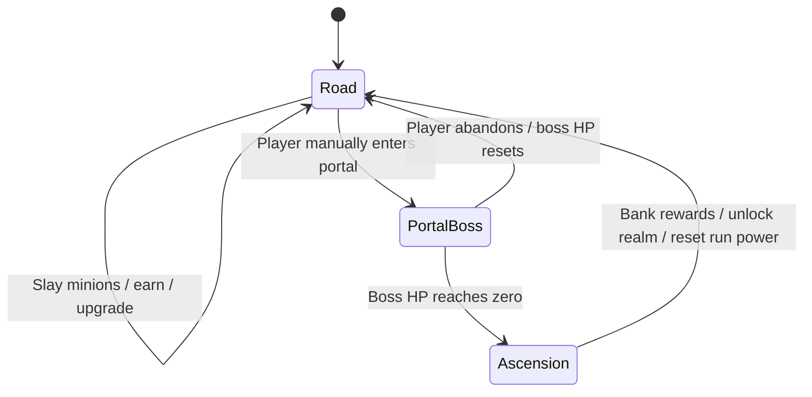

# Wanderblade — Design (GDD-lite)

Companion docs: [VISION.md](VISION.md) (why), [ECONOMY.md](ECONOMY.md) (numbers and simulation contract), [ROADMAP.md](ROADMAP.md) (when), [DECISIONS.md](DECISIONS.md) (decision history).

## Core loop

The hero is always in exactly one gameplay phase: **Road** or **Portal Boss**. Both phases progress online and offline and may last hours or days. Ascension is an atomic transition between them, not a third mode the player farms.

## World structure

- The world is divided into sequential **realms**. Each realm has its own road, threatened settlements, monster families, visual identity, and portal guardian.
- Monsters are emerging from portals and besieging the wider world. Towns and villages establish stakes and may appear as scenery, story beats, or discoveries; there is no town-management game.
- Road progress is divided into zones or waypoints for pacing and presentation. The portal becomes available when the realm's conditions are met, but entry is always manual.
- Defeating the guardian closes that realm's threat, unlocks the next realm, and immediately triggers ascension.
- The v1 realm sequence and exact portal conditions will be selected during content and economy design; they must not be encoded as lore-only assumptions in the engine.

## Content and SRD boundary

- The recognizable monster vocabulary is drawn from creatures explicitly present in **System Reference Document 5.2.1**, licensed under **CC-BY-4.0**.
- SRD inclusion is a whitelist, not permission to use material from other D&D books, settings, adventures, brands, or art.
- Wanderblade creates original creature art, animations, encounter groupings, stats, drops, portal lore, realm names, and boss presentation.
- [SRD-CONTENT.md](SRD-CONTENT.md) lists every approved SRD-derived name or description and reproduces the required attribution. See DECISIONS.md #17.
- Familiar examples include goblins, gnolls, and dragons only where the selected name/content is verified against the licensed SRD source.

## Phase 1 — The Road

The road is where the hero builds all temporary realm power.

### Automatic progression

- The hero walks forward and automatically fights endless portal minions.
- Kills grant gold, gear opportunities, collection progress, and **pending Ascendancy** according to the tuned economy.
- Offline and live auto-combat share the same deterministic engine path. Identical elapsed time, state, and player-action inputs must produce identical results.
- Idle-only players progress meaningfully but more slowly than players who engage in active sessions.

### Temporary realm build

- **Resets on ascension:** gold, hero level, equipped gear, temporary skill ranks, road/zone position, and other realm-local upgrades.
- Gear remains easy to evaluate: a stronger item is unambiguously stronger; collection completion must not require loadout math.
- Current-realm upgrades prepare the hero for one purpose: sustained DPS against the portal guardian.

### Active road play

Active play is a first-class design surface. The intended session is 15–30 minutes, once or twice a day, and playing attentively must provide a noticeable but bounded acceleration over idle progress.

**The mechanic set is decided: Momentum + Loot Arcs, expressed through one input.** `docs/ACTIVE-PLAY.md` is the specification; the numbers live in `docs/ECONOMY.md` and are not duplicated here.

- **Strike** — tap, click, or hold `Space`/`Enter` — is the only verb in v1, and it is the same verb in both phases.
- **Momentum** rises with each Strike and decays continuously toward zero. It multiplies **attack speed only**, never gold and never damage per swing, because an unbounded per-strike swing has no ceiling and no strike rate could then satisfy a bounded band (`docs/DECISIONS.md` #19).
- **Loot Arcs** carry each kill's gold as several coins in flight. Uncaught coins still credit full base value, so idle forfeits only the catch increment. Catching pays a multiplier on that coin's own share, and a catch is a position hit test at the strike's timestamp — never a queue (`docs/DECISIONS.md` #25).

The prior fixed bundle of Rally, Trailside Glints, and Roadside Discoveries is superseded. Its replacement, and any future one, obeys these contracts:

1. Active play is enjoyable in its own right, not repeated busywork.
2. Rewards are materially valuable and visible within one session.
3. Idle progress remains worthwhile and never becomes a punishment for closing the app.
4. Active actions layer onto deterministic baseline progression through explicit, auditable inputs.
5. The simulator must model representative idle and active player schedules before economy values ship.

## Phase 2 — Portal Boss

The portal guardian is an opt-in, persistent DPS encounter and the expression of the build assembled on the road.

### Entry

- Portal entry requires an explicit player action; there is no auto-challenge online or offline.
- The UI previews the guardian, current estimated duration, pending Ascendancy that will bank on victory, and the consequences of entering.
- Entering switches the hero out of road progression. Road kills, gold, loot, pending-Ascendancy accrual, and road movement stop.

### Combat

- Boss HP decreases from the hero's current sustained DPS and persists across sessions.
- Base boss damage advances offline using the same deterministic core as live play.
- Live tapping applies a bounded attack-speed boost through the **same momentum curve as the Road** — same input, same cap, same decay. Momentum multiplies boss DPS only, and the boss phase has no loot arcs because it pays nothing but damage.
- **Accessibility equivalent: holding the input auto-strikes at the cap-sustaining rate**, reaching the same ceiling as tapping. Rapid repeated input is never required. Cadence, cap, and decay values are in `docs/ACTIVE-PLAY.md`.
- What a committed fight *feels* like — hit reactions, damage readout, momentum display, victory beat — is client presentation and belongs to M3.
- The fight has no enrage timer, death, retry cooldown, or automatic failure. A boss may take hours or days.
- No gold, gear, or Ascendancy is earned while the boss fight is active.
- Purchases and build changes are locked during boss combat; the fight tests the build committed at entry.

### Abandonment

- The player may abandon at any time.
- Abandoning resets that attempt's boss HP to full and returns the hero to the same realm road.
- Existing temporary road power and the realm's pending Ascendancy are preserved. Only boss-damage progress is forfeited.

### Victory

Boss HP reaching zero triggers one atomic ascension transaction:

1. Add the boss payout to the realm's pending Ascendancy.
2. Transfer the entire pending amount into banked Ascendancy.
3. Record the boss trophy, realm completion, and persistent collection progress.
4. Apply the realm-completion bonus to future gold and passive/offline earnings.
5. Unlock the next realm.
6. Reset all temporary realm power and begin the next road at level 0.

## Ascendancy and persistence

### Two balances

- **Banked Ascendancy** persists across realms and may be spent from the Ascendancy tree whenever the hero is on the road.
- **Pending Ascendancy** is earned during the current realm and displayed as an unclaimed total. It cannot be spent or persist independently; portal victory transfers it into banked Ascendancy during ascension.
- Abandoning a boss does not erase pending Ascendancy; victory is still required to bank it.
- Ascendancy purchases are locked during portal-boss combat.

### Permanent power

- The Ascendancy tree unlocks combat skills and passives. It is the primary source of persistent combat power.
- Every boss victory separately grants an automatic, persistent percentage bonus to gold and passive/offline earnings. It does **not** directly grant combat power.
- This automatic economy bonus ensures moving forward is more productive than farming one completed realm forever.
- Accrual, boss payout, node costs and effects, and the earnings-bonus rate are tuned and passing across seeds; the constants live in `packages/core/src/constants.ts` and the bands they satisfy in `docs/ECONOMY.md`.
- The tree is **uncapped with a linear price curve** — a node always has a next rank, and depth is paced by cost rather than by a ceiling (`docs/DECISIONS.md` #27).

### Persistence matrix

| State | On boss abandonment | On boss victory / ascension |
|---|---|---|
| Gold, level, gear, temporary upgrades | Persist | Reset |
| Road position | Persist | Reset into next realm |
| Boss HP damage | Reset | Boss defeated |
| Pending Ascendancy | Persist, still unbanked | Boss payout added, then banked |
| Banked Ascendancy and purchased nodes | Persist | Persist |
| Realm-completion economy bonuses | Persist | Persist and increase |
| Bestiary, gear-set records, stars, trophies, titles | Persist | Persist and record victory |

## Collections

- **Bestiary:** persistent discovery and mastery records for monster species.
- **Gear sets:** persistent records of realm gear found, independent of equipped items resetting.
- **Realm stars:** boss defeated, gear set completed, and bestiary completed.
- **Boss trophies:** permanent proof of portal guardians slain.
- Collection records survive ascension. Any collection reward that affects combat must be implemented as an explicit Ascendancy-tree skill/passive; collections do not provide a separate or hidden DPS multiplier.

## Presentation

- The Road screen remains a side-scrolling pixel diorama with a visible hero, enemies, drops, goals, and upgrades.
- The Portal Boss screen is **a dungeon**, not the road with a guardian standing in it (DECISIONS.md #58).
  - **Enclosed.** Stone walls and a visible ceiling close the frame. No sky, no horizon, no parallax, no scrolling. The road's visual argument is travel; this one's is that there is nowhere left to go.
  - **One monster, filling the space.** The guardian is drawn large enough to dominate, with the hero confronting it alone — the scale contrast is the point.
  - **Lit from the fight.** The only light sources belong to the encounter, so the frame darkens toward its edges instead of resolving into distance.
  - Centered on boss HP, hero DPS, estimated time remaining, and the active attack-speed input.
- The art register remains vibrant 16-bit **Pixel & Parchment**: DB32 palette, hard edges, wood/parchment chrome, Pixelify Sans UI, and VT323 numerals (DECISIONS.md #13).
- Display interpolation never feeds back into the engine. Affordability, rewards, boss HP, and ascension use authoritative core state.

## Screens

1. **Road** — diorama, hero, road encounters, gold, pending Ascendancy, temporary upgrades, and the manual portal-entry flow.
2. **Portal Boss (the dungeon)** — an enclosed stone room with one guardian filling it (DECISIONS.md #58–#61). One HP bar, hero DPS, time remaining, the same Strike as the Road, and a hold-to-abandon button that fills before it fires.
3. **Hero** — current realm level, gear, temporary skills, and persistent Ascendancy unlocks.
4. **Collection** — Bestiary, gear-set records, realm stars, and boss trophies.
5. **World** — completed realms, current realm, threatened settlements, next portal, banked Ascendancy, and the Ascendancy tree.
6. **Return recap** — road earnings while away or boss damage dealt while away; never claims road income during boss combat.
7. **Ascendancy** — a panel opened from the Road: pending and banked Ascendancy, the three tree nodes with rank and price, and the realm earnings bonus (DECISIONS.md #16, #27). Purchases are the only persistent combat power (guardrail 8).
8. **World's Edge** — the state at the end of the realm ladder. Specified below.

### Client mechanics decided outside this document

| Mechanic | What it does | Where it is decided |
|---|---|---|
| Hold-to-autostrike aim (`app/src/hold.ts`) | A held thumb strikes at the cap rate. Sliding onto a coin aims at it; a keyboard hold aims at nothing | DECISIONS.md #19, #25 |
| Feel (`app/src/feel.ts`) | Every hit, catch and purchase has a synthesized sound and a haptic pulse. No audio files; fed only by engine events | DECISIONS.md #12 |
| Dev staging (`app/src/devstage.ts`) | `?stage=fresh\|mid\|late&seed=n` advances real engine time so a capture shows a deep run. Never writes a display value | DECISIONS.md #12; `tools/qa/README.md` |
| Thumb harness (`npm run thumb`) | Models a late, loose human thumb against core and reports catch rate and aimed-coin share per latency | DECISIONS.md #43, #47 |

### World's Edge — the state at realm 300

**When it happens:** a steady active player reaches realm 300 around **day 76**, an idle player around **day 92** (`docs/DECISIONS.md` #48). This is a real player's third month, not a theoretical horizon, and it is how much time M4's ending has.

**The requirement:** a player who finishes realm 300 must see something that reads as *the end of the current world*, never a portal button that quietly does nothing. `enterPortal` returning `reason: 'unwinnable'` is an engine value, not a design (`docs/DECISIONS.md` #34); this is the design it has to carry. Core work is done — the client work is `builder-visual-3`'s.

**What the player sees, and what it must not be:**

| The Road behaves normally | It keeps paying gold, dropping gear, and clearing zones. Nothing is taken away, and nothing hangs. |
| The portal is visibly closed, not broken | It reads as sealed or spent — a thing that has ended — never as a greyed-out button or a failed tap. Tapping it explains, it does not shrug. |
| The recap is a conclusion | Realms cleared, guardians felled, Bestiary completion, total banked Ascendancy. The run is *finished*, not stuck. |
| The hero is at the edge of the map | `docs/VISION.md` already sells "World's Edge" as the long-horizon destination. This is that place, and it should look like arriving somewhere rather than hitting a limit. |

**What it must never be:** a modal that says "maximum realm reached", a number that stops incrementing without comment, an error, or a portal that accepts a tap and does nothing. A player who cannot tell whether they finished the game or found a bug will conclude it is a bug, and they will be right to.

**This is a placeholder for a real ending, and it is scheduled.** `docs/ROADMAP.md` M4 owes the world a designed conclusion — or a defined endless mode — at or before realm 300. Until that lands, World's Edge is what stands between a player and a wall.

## Deferred expansion: companions

A future major system may add companions inspired by the familiar fighter, mage, priest, and thief party shape. This is not a v1 commitment. If pursued, the player remains the central hero and companions must not turn the game into party administration, loadout spreadsheets, or a manager fantasy. Companion mechanics require their own design, economy simulation, and persistence decision.

## Open design work

These are explicit follow-up designs, not implied implementation details:

- **The session arc.** The mechanic set, its cadence, and its uplift are decided and measured; how a 15–30-minute sitting is *shaped* — what opens it, what marks its middle, what makes it a satisfying place to stop — has never been designed. `P1` measures a flat 20-minute window, which is a rate, not an arc.
- **Boss-fight feedback.** The input, cap, decay, and accessibility equivalent are specified; what the player sees and hears while committed is not. Client work, M3.
- **Abandonment UX.** The rules are decided and simulated — abandoning forfeits only boss-damage progress, and `abandonProbe` measures what that costs. The protected flow that keeps it from being a mis-tap is undesigned. Client work, M3.
- Realm sequence, SRD-verified monster roster, portal guardians, and original setting treatment.
- **A designed ending, or a defined endless mode.** The realm-300 ceiling is a float64 artifact, not a chosen finale, and an active player meets it around day 76 (`docs/DECISIONS.md` #48). *World's Edge* above is the placeholder that keeps it from reading as a bug; the ending itself is M4's, alongside the big-number work of #34.
- **What a gear slot means.** Partly answered: `SLOT_POWER` gives each slot a distinct mean-1 weight, so the three no longer read as one distribution (`docs/DECISIONS.md` #40). What is still open is a mechanical *role* — there is no defence stat for armor to feed and no utility layer for a trinket, so slots differ in magnitude but not in kind. Blocked on the M4 gear-set and Bestiary design.
- **Per-zone monster identity.** Landed in core (ADR #37): a kill carries a species index, pays that species' share of the zone rate, and rolls its drop against that species' weight; `collection.speciesKills` records them. Enemy HP is still uniform, because kill time is the clock. What remains is M4 content — the SRD roster, names and provenance. *Superseded description of the old state:* The engine had none: `enemyHp(realm, zone)` and `enemyGold(realm, zone)` are pure functions of position, `GameState` carries no monster field, and a drop's rarity is rolled from the kill-keyed stream with no reference to what died. A Bestiary and differentiated drops therefore need core work before content: a monster identity on the kill, carried into the drop roll and into `collection`. Nothing about the current model blocks it — the RNG is already keyed per kill — but it is a core change, not a content table.
