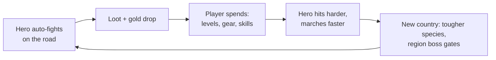

# Wanderblade — Design (GDD-lite)

Companion docs: [VISION.md](VISION.md) (why), [ECONOMY.md](ECONOMY.md) (numbers), [ROADMAP.md](ROADMAP.md) (when).

## Core loop

## World structure

- The realm is **one long road**, west to east, divided into **regions** (biomes). Each region contains several **zones**; each zone has its own monster species mix; each region ends at a **named boss** whose fall opens the next region.
- Headline progression number: **leagues traveled** (alongside gold). The road is a side-scrolling diorama that visibly transforms as you cross biome boundaries.
- Region list v1 (working): Greenwood → Ruinfields → Mistmarsh → Ironhills → Ember Wastes → Dragon Peaks → **World's Edge** (v1 finale).

## Systems

### Combat (automatic)
Hero walks right; monsters spawn ahead; hero auto-attacks. Kill time = enemy HP / hero DPS. Fast kills read as marching; slow kills read as a fight. Deterministic rules only — combat must produce identical results in the offline simulator and live play; all randomness (drops) flows through a seeded PRNG keyed to kill index (see ECONOMY.md "Simulator & determinism contract" and DECISIONS.md #6).

### Gear
- Three slots in v1: **weapon, armor, trinket**. Drops have rarity tiers.
- **No stat weighing**: a better item glows and one tap (or auto-equip) wears it. Bigger = better, always.
- Each region has a **gear set** to complete (collection, not power puzzle).

### Skills
- 3–5 **signature skills** total in v1, unlocked at milestones, auto-cast with a visible flourish. The only choice is which to upgrade next.
- Economically, skills are steady DPS multipliers with their own cost curve (see ECONOMY.md) — the auto-cast flourish is presentation, not math, so the simulator can price them.
- Each skill's multiplier is **bounded**: a fixed number of ranks (M0 prototype: `maxLevel` 10, ×1.5 each / ×2.25 both), so the multiplicative term is a finite ceiling that can never run away. A maxed skill shows **MAX** in the upgrade drawer.

### Road Play (optional active layer)
The Idle Slayer lesson, adopted and inverted: active play lives in the grind stretches between decisions — and is **always a live-only, additive bonus**. The seeded kill/drop stream never changes; taps only layer extra on top. The idle baseline must hit every pacing target with zero taps (see ECONOMY.md "Active-play overlay"). Idle Slayer's failure mode — active play becoming near-mandatory for good rates — is the explicit anti-pattern.

- **Trailside Glints (v1):** kills spin loot into gentle arcs across the road; tap a glint before it fades for bonus gold. Density scales with kill speed. Occasionally an oversized **jackpot glint** (a gilded road champion dripping with loot) swaggers through. Uncaught glints simply fade — the idle player loses nothing.
- **Roadside Discoveries (v1):** roughly once per check-in, a point of interest drifts into view — a wayside shrine, a half-buried chest, a lookout over the next biome. Tap to investigate for bonus gold, a small buff charm, or a **Wayfarer's Log** entry (a light second collection axis beside the Bestiary).
- **Deferred candidates:** *Heroic Finisher* (tap to land killing blows on tough foes; small capped Momentum multiplier) — revisit once tap-feel is proven; *Focus the Hunt* (aim the grind at an unmastered species) — M2+, needs the Bestiary.

### Bestiary (the mastery spine)
- Every species has kill-count mastery tiers. Completing a tier grants a small **permanent global damage bonus** and completion credit.
- The fantasy: *"this region is mine now."*

### Zone stars
Per region, three stars: **boss slain ★ · gear set complete ★ · bestiary complete ★**. The whole-game completion meta is the star ledger.

### Offline travel
- Deterministic simulation using the same rules as live play (same `packages/core` code path).
- Return presents the **"Back on the Road"** recap: leagues traveled, kills, loot sack, notable events (boss reached, new region entered).
- Cap policy: provisionally **generous/no cap** for the prototype (DECISIONS.md #8); revisit after M1 playtest.

### Region boss gates (opt-in)
Bosses are opt-in set-piece events, not passive walls (DECISIONS.md #9).

- Clearing a region's last zone brings the hero to the **Gate**: the boss looms ahead while the hero farms the approach zone at **full trash income** (gold, gear, Bestiary progress) — a gate pauses leagues, never income. This eliminates the dead-stall failure mode where an offline session at a wall produced nothing visible.
- A **Readiness meter** makes "am I ready?" a one-glance call: `Readiness = (hero DPS × 30 s enrage window) / boss HP`, rendered as a not-yet → glowing-**Ready** meter. No math exposed to the player.
- Tapping **Challenge** locks the camera into a 10–30 s set-piece: the boss's HP bar fills the top, signature skills flash, the boss telegraphs (cosmetic) attacks — resolving deterministically to a cinematic kill (region ★, road opens) or the enrage timer expiring (*"too strong… for now"*).
- **Failure is painless:** no death, no lost progress; the hero pulls back and resumes farming. A ~60 s retry cooldown keeps the fight a moment, not a slot machine.
- **Auto-challenge (default on):** fires automatically — offline too — once Readiness crosses ~110%, so a zero-interaction idle player always breaks through eventually via farmed gear. Turning it off (pure opt-in) is a settings toggle.
- **Gates continue beyond World's Edge.** In the M0 prototype every region ends at a gate, including the endless-scaling tail past the v1 finale — so the post–World's-Edge road stays paced (a readiness wall stops sprints; parked farming lets gear catch up) instead of running away. Until M2 prestige (New Road) resets the hero at World's Edge, this gates-forever structure is what keeps the tail from out-running its own gear.
- Outcome is a pure function of DPS vs. HP, so gate fights are identical in the offline sim and live play.

### Prestige — "New Roads" (build in M2; design decided — DECISIONS.md #7, #11)
**Rhythm: many roads.** The first New Road becomes attractive around **day 2–3**, at the first real wall; resets are frequent, light, and penalty-free. **World's Edge is a multi-run goal** — the journey is conquered across many roads, each pushed farther by the legend of the last.

- **Earn:** Legend is granted on reset from the run's frontier — draft `Legend = floor(L0 · (1.30^z_max − 1))`, presented as chunky per-boss nuggets in the reset recap (*"Ruinfields boss felled → +X Legend"*). Constants are an M2 sim task (ECONOMY.md).
- **The preview IS the mechanic** (Idle Slayer's key lesson): an **unearned-Legend bar** is always visible, and the reset screen shows the concrete haul *before* committing — *"collect X Legend → Veteran's Edge +15% damage forever, start at Zone 12"* — so a reset reads as claiming a reward you can already see, never as wiping a save.
- **Spend:** a small permanent tree (~6–8 nodes, single-tap ranks, rising Legend cost, **no re-buys, no respec math** — Idle Slayer's per-reset re-buy busywork is explicitly rejected). v1 node list: Veteran's Edge (+% global DPS), Wayfarer's Purse (+% gold), Roadwise (start each road at zone N), Traveler's Fortune (+% drop rate/rarity), Tireless March (+% offline income), Boss-Bane (+% boss damage / longer enrage window), Legend's Momentum (+% Legend earned next road), Quartermaster's Cache (starter gear + gold).
- **Re-run feel target:** the second run re-reaches the prior frontier in ~20–30% of the original wall-clock.
- **First-reset experience:** offered (never forced) at the first hard stall; the confirm screen foregrounds what persists; the reset immediately cashes into 1–2 chunky upgrades + Cache + head-start, so the first post-reset minute delivers the VISION fantasy in compressed form — one-shotting monsters that were walls minutes ago.

**What survives a New Road (decided — DECISIONS.md #7):**
- **Persists:** Bestiary records *and* mastery bonuses, gear-set completion records, zone stars, titles, Trophy Hall, Legend. Collection is the "forever" engine — it never resets.
- **Resets:** hero level, gold, equipped gear power, road/zone progress.

**M1 implication:** the save data model must separate prestige-persistent state from run-local state from day one, even though prestige itself ships in M2.

## Screens (v1)

1. **Road** (main) — diorama, hero, counters (gold, leagues), upgrade drawer; glints and discoveries drift through; boss gate + Readiness meter when parked.
2. **Hero** — level, gear slots, skills.
3. **Collection** — bestiary, gear sets, zone stars, Wayfarer's Log.
4. **Map** — region progress, boss gates, the road so far; the between-run meta home for the unearned-Legend bar, the Legend tree, and the "Set Out on a New Road" flow (never part of a check-in).
5. **Recap modal** — "Back on the Road" (shown on return after absence).

## Open questions

**Provisionally decided (revisit with evidence, don't relitigate casually):**
- Offline earnings cap → generous/no cap for prototype (DECISIONS.md #8).
- Prestige persistence split → collections persist, power resets (DECISIONS.md #7).

**Genuinely open:**
- Legend earn/spend constants (M2 sim task — extend the bot to prestige greedily and validate the flywheel).
- Reset availability: New Road from anywhere via the Map screen (best relief valve) vs. only at gates (cleaner milestone). Lean: **anywhere**, guarded against prestige-spam by the frontier-based earn curve.
- "Realm remixes" on a New Road: literal region reshuffling (big build) vs. a fresh power-run down the same road. Lean: **same road for v1**; remix is a v2 novelty lever.
- Roadwise head-start tuning: does skipping early zones starve Bestiary/gear-set completion, and how do collections keep filling without forcing replay of trivial zones?
- Materials/forging system — v1 leans **gold-only** for simplicity.
- Art direction specifics — deferred; grey-box first (M1), art pass in M3.

*(Random road events graduated from this list into the shipped design as Roadside Discoveries.)*
